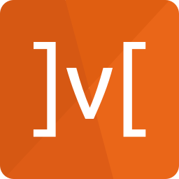
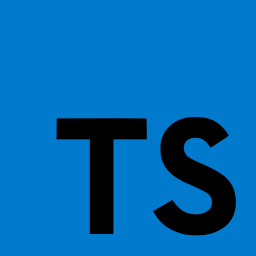
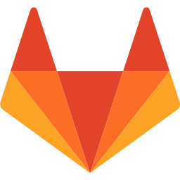

<h2 align="center">О себе</h2>

Я — веб-разработчик. Ранее занимался математическим моделированием, но в 2022 году решил переквалифицироваться, для чего окончил курс веб-разработки в Я.Практикуме. 
После этого стажировался в компании Antipoff Group, где работал над проектом <a href="http://tpdeti.ru">"Туристический паспорт школьника"</a>.
 

Профессиональную деятельность в качестве веб-разработчика я начал с проекта по созданию магазина, специализирующегося на торговле запчастями для китайских автомобилей.

C лета 2024 года работаю в компании I-Tech.

В свободное время занимаюсь изучением новых технологий и продолжаю совершенствование своих навыков в вёрстке и JavaScript.

<h2 align="center">Репозиторий</h2>

В данном репозитории собраны мои учебные, тестовые и пет-проекты.

<h2 align="center">Мои навыки</h2>
<h3>На текущей работе использую:</h3>

 

  
  
  

  
  
  

<h3>Помимо этого работал с:</h3>
 
 

 
  
  
  
  
  
  
  
  
  
  
  
  
  
  
  
  
  
  

<h2 align="center">Моя статистика</h2>

<!--
**MikhailSulim/MikhailSulim** is a ✨ _special_ ✨ repository because its `README.md` (this file) appears on your GitHub profile.

Here are some ideas to get you started:

- 🔭 I’m currently working on ...
- 🌱 I’m currently learning ...
- 👯 I’m looking to collaborate on ...
- 🤔 I’m looking for help with ...
- 💬 Ask me about ...
- 📫 How to reach me: ...
- 😄 Pronouns: ...
- ⚡ Fun fact: ...
-->

 
 

